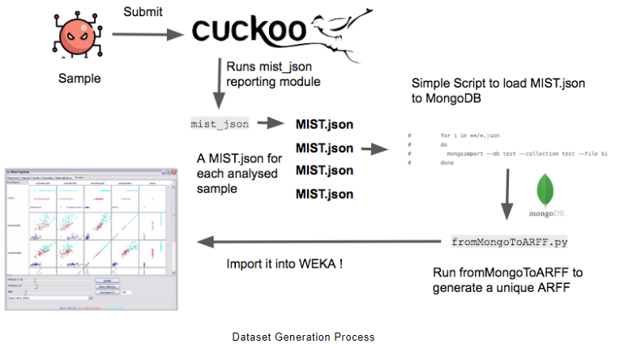

# Cybersecurity-MachineLearning

<h3 align="center">
  
</h3>

# MalwareTrainingSets dataset description:

MalwareTrainingSets is a testing-set based on a modified version of Malware Instruction Set for Behavior-Based Analysis (MIST). Marco et al., 2016 proposes the following flow in the construction of the data set.

<h3 align="center">
  
</h3>

Link dataset base line: https://marcoramilli.com/2016/12/16/malware-training-sets-a-machine-learning-dataset-for-everyone/

# MalwareTrainingSets machine learning approach:

The objective of this repository is to study different machine learning classification algorithms, around the statistical study of the Malware Training Sets dataset.

Slides: https://docs.google.com/presentation/d/147Ocgm59LOvRfjy3aeXBsNuOqIm2nD6F/edit?usp=sharing&ouid=114172395456761878668&rtpof=true&sd=true